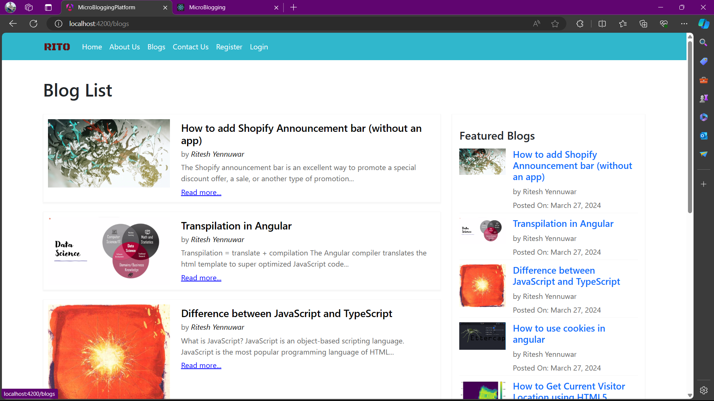

# MicroBlogging_Platform

MicroBlogging_Platform is a web application for microblogging where users can register, login, and br through blogs

## Working Video
[](src/assets/demo.mp4)

## Technologies Used

- Frontend: Angular
- Backend: Node.js, Express.js
- Database: MongoDB Atlas
- Other libraries: bcrypt, mongoose, Angular Material

## Installation

1. **Clone the repository:**

   ```bash
   git clone https://github.com/RiteshYennuwar/MicroBlogging_Platform.git
   cd MicroBlogging_Platform
2. **Install dependencies for both frontend and backend:**
    ```bash
    npm install
    cd api
    npm install
3. **Replace mongodb-uri in `api/models/user.js` with your mongodb uri**
3. **Start the backend**
    ```bash
    cd api
    npm start
4. **Start the frontend development server:**
    ```bash
    cd ..
    ng serve
5. **Open your browser and navigate to http://localhost:4200.**

## Contributing
Contributions are welcome! Please fork the repository and create a pull request with your changes.
